  

  
  
  

  <i>Building AI products that feel calm, useful, and quietly intelligent.</i>

  
  

  

  

  Designed as a calm, glass-like GitHub profile. Replace <code>your-email@example.com</code> before publishing.

